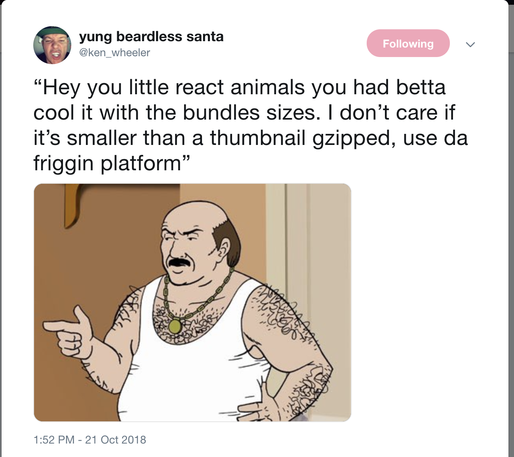

import { Appear } from 'mdx-deck'
import { FullScreenCode } from 'mdx-deck'
import { Image } from 'mdx-deck'
import { SplitRight } from 'mdx-deck/layouts'


import { Link } from './components/link'
import { Header } from './components/header'

export { default as theme } from './theme'


# Gotta Go FAST
## Productive Web Components

```notes
```
---
### What is this talk?

- What are Web Components?
- Look at core concepts and building blocks
- Build our first vanilla Web Component
- Explore use cases
- Learn what FAST Web Components can offer

---



```notes
- define Platform: tools natively available in the browser
- using them lends to better:
  - performance
  - longevity
  - support
```
---

import { Split } from 'mdx-deck/layouts'

## What are Web Components?

Web Components are a meta-specification:

<ol>
  <Appear>
    <li style={{textAlign: 'left'}}>The ES Module specification</li>
    <li style={{textAlign: 'left'}}>The HTML Template specification</li>
    <li style={{textAlign: 'left'}}>The Custom Elements specification</li>
    <li style={{textAlign: 'left'}}>The Shadow DOM specification</li>
  </Appear>
</ol>

```notes
- Ask if everyone knows what a spec is
- Appear
```

---

### ES Modules

- Lots of drama (esm vs webpack vs regular script)
- Possible pros: speed
- standardization
- code-splitting, import style syntax

---

### ES Module importing
```jsx
<script type="module" src="cool-component.js"></script>
```

```jsx
<script type="module">
  import 'cool-component.js';
  import { CoolComponent } from '@mds/cool-component';
</script>
```

```notes
- Covered only because the docs say it's a part
- An 'optional' part of web components
- FAST leans heavily on ESM
```
---

## HTML Templates

##### Mechanism for reuse of similar mark up structures

<ul>
  <Appear>
    <p>Pros:</p>
    <li style={{textAlign: 'left'}}>Unused at page load, instantiated at runtime</li>
    <li style={{textAlign: 'left'}}>Will not render until used</li>
    <li style={{textAlign: 'left'}}>Will not fetch scripts tags </li>
    <li style={{textAlign: 'left'}}>Will not load assets (images, svgs) </li>
    <li style={{textAlign: 'left'}}>Will not appear on the DOM</li>
  </Appear>
</ul>

```notes
- appears
- skeleton; view; reusable
- performance implications
- kind of not there?
```
---

```jsx
<template id="template__logo">
  <style>
    .logo {
      border: 1px solid white;
    }
  <style>
  <!-- this img src won't be in the network tab -->
  <a href="https://very-important-business.com/">
    
  </a>
</template>

<script>
  const template = document.getElementById('template__logo);

  // You can modify the template before instantiation
  template.content.querySelector('img').alt = 'A really orange logo';
  // Create an instance of the template
  const clone = document.importNode(template.content);
  document.body.appendChild(clone)
</script>
```

---
##### yields...

```jsx
<body>
    <style>
      .logo {
        border: 1px solid white;
      }
    <style>
    <a href="https://very-important-business.com/">
    
  </a>
</body>
```
---

### HTML Templates

- Templates are mutable (note the alt)
- Not particularly useful on their own
- The "View" for custom elements

```notes
- Not particularly useful on it's own
- The view of a Custom Element
```
---

## Custom Elements

- Create your own HTML tags
- Powered by ES6 Classes
- Implement custom behaviors and styling
- Bread and butter of what one generally considers a "web component"

```notes
- Bread and butter of what we think of as Web Components
- Class API is nice
```
---
## Our First Custom Element

```js
class MyNewFancyButton extends HTMLElement {
  ...
}
customElements.define("my-new-fancy-button", MyNewFancyButton);

// n.b. a - is required in the name
<my-new-fancy-button variant='primary' > Enterprise Click Me® </my-new-fancy-button>
```


```notes
- Problem: It doesn't do anything
- Has none of the default styling of <button>
- No onclick attribute, nothing

- What if I do want my own button?
```
---
## Extending Existing Tags

### Customized Built Ins

```js
<script>
class CustomizedButton extends HTMLButtonElement {
  ...
}
customElements.define("customized-button", CustomizedButton, { extends: "button" });
</script>
<button is="customized-button">Click Me :)</button>
```
---

### Lifecycle Methods

<ul>
  <li style={{textAlign: 'left'}} style={{textAlign: 'left'}}> <code>connectedCallback</code> </li>
    <ul>
      <li style={{textAlign: 'left'}} style={{textAlign: 'left'}}> Runs when an element is connected to the DOM. i.e. instantiation </li>
    </ul>

  <li style={{textAlign: 'left'}} style={{textAlign: 'left'}}> <code>disconnectedCallback</code> </li>
    <ul>
      <li style={{textAlign: 'left'}} style={{textAlign: 'left'}}> Runs when an element is disconnected to the DOM. i.e. deleted (not hidden) </li>
    </ul>

  <li style={{textAlign: 'left'}} style={{textAlign: 'left'}}> <code>adoptedCallback</code> </li>
    <ul>
      <li style={{textAlign: 'left'}} style={{textAlign: 'left'}}> Runs when document.adoptNode() is used. Useful in the context of iframes </li>
    </ul>

  <li style={{textAlign: 'left'}} style={{textAlign: 'left'}}> <code>attributeChangedCallback</code> </li>
    <ul>
      <li style={{textAlign: 'left'}} style={{textAlign: 'left'}}> <strong> IMPORTANT</strong>: Does not do change detection </li>
    </ul>
</ul>

---

### Lifecycle Methods

tl;dr awesome features of the browser, but a little primitive for my taste

```notes
- connected and disconnected useful for managing memory leaks i.e. event listeners, observables
- document.adoptNode() moves documents from one object to another

Really cool because this is generally a thing we reach out to frameworks for

Not trivial to Implement

A little too primitive for me. cf. attributeChangedCallback
```

---

### Shadow DOM

#### Encapsulation for the DOM (finally)

- Usage: removing styling collisions e.g.
  - Ids
  - Naming
  - Cascading in general

```notes
- css sucks
- joke: can't encapsulate code blocks
```
---

You can add shadow DOM to:
<Appear>
  <p> <strong style={{ fontSize: '60px', fontWeight: 900}}> Any custom element </strong>  </p>
  <p style={{ fontSize: '10px'}}> article </p>
  <p style={{ fontSize: '10px'}}> aside </p>
  <p style={{ fontSize: '10px'}}> blockquote </p>
  <p style={{ fontSize: '10px'}}> body </p>
  <p style={{ fontSize: '10px'}}> div </p>
  <p style={{ fontSize: '10px'}}> footer </p>
  <p style={{ fontSize: '10px'}}> h1 </p>
  <p style={{ fontSize: '10px'}}> h2 </p>
  <p style={{ fontSize: '10px'}}> h3 </p>
  <p style={{ fontSize: '10px'}}> h4 </p>
  <p style={{ fontSize: '10px'}}> h5 </p>
  <p style={{ fontSize: '10px'}}> h6 </p>
  <p style={{ fontSize: '10px'}}> header </p>
  <p style={{ fontSize: '10px'}}> main </p>
  <p style={{ fontSize: '10px'}}> nav </p>
  <p style={{ fontSize: '10px'}}> p </p>
  <p style={{ fontSize: '10px'}}> section </p>
  <p style={{ fontSize: '10px'}}> span </p>
  <p style={{ fontSize: '10px'}}> not code????????? </p>
</Appear>

```notes
- lots of appears
```

---
## How To Shadow DOM

```js
const main = document.createElement('main');
const shadowRoot = main.attachShadow({mode: 'open'});
shadowRoot.innerHTML = '<h1>Sneakin' around in the shadows</h1>';
```

<Appear>
  <p> Quiz! </p>
  <p> If we changed <code>'open'</code> to <code>'closed'</code>, what do you think would happen if we tried to access the element?</p>
  <p> <code> console.log(shadowRoot) // null </code> </p>
</Appear>


```notes
- Closed doesn't ever let you reference shadowRoot
```

---
export default Split

```jsx
<!-- global styles -->
<style>
  :root {
    --competitor-primary: #1D1075;
    --cool-company-primary: #F96302;
  }
  body { color: white; }
  .text-primary {
    background-color: var(--competitor-primary, deepblue);
    color: black;
  }
</style>
<test-element>
  #shadow-root
    <style>
      .text-primary {
        color: white;
        background-color: var(--cool-company-primary, darkorange);
      }
    </style>
    <div class="text-primary">
      We sell things™️
    </div>
</test-element>
```
<style>
</style>
<Appear>
  <p style={{ marginLeft: '10px'}}> What color is the background of "We sell things"? </p>
  <p style={{ marginLeft: '10px'}}> Orange </p>
  <p style={{ marginLeft: '10px'}}> <code>document.getElementByClassName('.text-primary')</code></p>
  <p style={{ marginLeft: '10px'}}> <code> null </code> </p>
  <p style={{ marginLeft: '10px'}}> <code>document.getElementByClassName('test-element >>> .text-primary')</code></p>
  <p style={{ marginLeft: '10px'}}> <code> div.text-primary </code> </p>
</Appear>

```notes
- This view is from Dev Tools
- Quiz answers:
- white
- orange
- null
- <div class="lowesify"></div>

- shadow piercing selector

- key idea: you can't get through it!
```

---
### Slots

Mechanism for composition

cf. React Render Props, HOCs, Vue Slots, Angular ng-transcludes


```notes

```
---
### Slots

`<my-header>` template:
```jsx
<header>
  <h1>My Website</h1>
  <button>Menu</button>
</header>
```
<Appear>
  <p> What if we want to change the content of the h1 tag dynamically? </p>
</Appear>


```notes
Slots allow for composition
```
---

export default SplitRight

```jsx
<!-- output -->
<header>
  <h1>
    <a href="https://very-important-business.com/"> Buy Things™️ </a>
  </h1>
  <button>Menu</button>
</header>
```

```jsx
<!-- template  -->
<header>
  <h1><slot name="website-link"></slot></h1>
  <button>Menu</button>
</header>
```

```jsx
<!-- usage -->
<my-header>
  <a slot="website-link" href="https://very-important-business.com/"> Buy Things™️ </a>
</my-header>
```

```notes
- can name and specify multiple slots with name attribute
- mention adding custom search bar in header, could be framework specific component
```

---

## How to tie it all together

<Appear>
  <a
    href="https://stackblitz.com/edit/typescript-x1rhe3?file=index.html"
    target="_blank"
  >
    
  </a>
</Appear>

```notes
Things to look at in example
- Use of lifecycle methods
- Attribute code
```

---

#### In Review

  ##### Pros:
  <li style={{textAlign: 'left'}}>Use the Platform™️</li>
  <li style={{textAlign: 'left'}}>Shadow DOM is 🔥🔥🔥</li>
  <li style={{textAlign: 'left'}}>Lifecycle methods, while sparse, are great primitives</li>

  ##### Cons:
  <li style={{textAlign: 'left'}}>Platform doesn't have any training wheels</li>
  <li style={{textAlign: 'left'}}>Lots of boilerplate</li>
  <li style={{textAlign: 'left'}}>Templates are awkward</li>
  <li style={{textAlign: 'left'}}>Attribute management is awkward</li>
  <li style={{textAlign: 'left'}}>Templates help, but code splitting/optimization not free</li>

---

## FAST Web Components

- Vanilla boilerplate disappears
- More powerful lifecycle hooks
- Bindings turn attributes from a pain to a joy
- Code splitting out of the box (with ESM)
- Typescript out of the box
- Design Systen primitives with `@microsoft/fast-components` and `@microsoft/fast-foundation`

---
# FAST Features

- Featureful, blazing fast template engine
- CSS authoring with `Constructable Stylesheet Objects` and Shadow DOM
- Bindings systems (attributes++)
- Directives

---

## Your First Component

```js
import { FASTElement, customElement, attr, html } from '@microsoft/fast-element';

const template = html<NameTag>`
  <div class="header">
    <h3>${x => x.greeting.toUpperCase()}</h3>
    <h4>my name is</h4>
  </div>

  <div class="body">TODO: Name Here</div>

  <div class="footer"></div>
`;

@customElement({
  // name-separator still necessary
  name: 'name-tag',
  template
})
export class NameTag extends FASTElement {
  @attr greeting: string = 'Hello';
}
```

---

## Attributes

- external state for FAST components (think props in React)
- just like vanilla attributes, but better change handling

```js

@customElement('name-tag')
export class NameTag extends FASTElement {
  @attr greeting: string = 'Hello';

  // fires when greeting changes
  greetingChanged() {
    alert(`${this.greeting}`)
  }
}
```

---

## Observables

- internal state for FAST components
- just javascript™️

```js

@customElement({name: 'name-tag', template})
export class NameTag extends FASTElement {
  @attr greeting: string = 'Hello';

  // fires when greeting changes
  greetingChanged() {
    alert(`${this.greeting}`)
  }
}
```

---

## Templates

- `ViewTemplate` instances created via the `html<T>` calls
- `html` is generic to add type hints for bindings

```js
const template = html<Intro>`
  <p> hello world </p>
`;
```

---

## Templates - Bindings

- the main power of the template engine
- help make content dynamic, and help bind to your model (the class)
- bindings `${(x,c) => /*use view data*/ x.name}
- `x` is the reference to your component's class
- `c` is the `ExecutionContext`
---
## Templates - Bindings

```js
const template = html<NameTag>`
  <div class="header">
    <h3>
      <!-- content binding -->
      ${x => x.greeting}, my name is
      <span class="name ${x => x.employee.favoriteColor}">${x => x.employee.name}</span>.
    </h3>
    <name-card
      <!-- property binding -->
      :department=${x => x.employee.department.name}
      <!-- boolean property binding -->
      ?highlighted=${x => x.employee.isEmployeeOfTheMonth}
    >
      
        src=${x => x.employee.imgSrc}
      />
    </name-card>
  </div>
`;
```

---

## Templates - Event Bindings

```js
const template = html<UserForm>`
  <div>
    <input
      type="text"
      @input="${(x, c) => x.validateUserName(c.event)}"
    >
    <button
      @click="${x => x.handleAddUser(c.event))}"
    >
      Add User
    </button>
  </div>
`;
```

---

## Directives

- Helper functions that help interact with the DOM
- Tied into the templating engine
- 3 Kinds: structural, referential, host

---

## Directives (structural)

Structural directives help with manipulating the DOM

`when` lets us conditionally render templates
```js
const template = html<Loading>`
  ${when(
    (x) => x.loading, // binding to our component's data model
    html`
    Loading...
  `}
`;
```
---

## Directives (structural)

`repeat` lets us iterate in template
```js
const template = html<Employees>`
  ${repeat(
    (x) => x.employees, // employees: Employee[]
    html<Employee>` // x: Employee
      <div>
        <!-- x == employee[i] -->
        <employee-card :employee=${(x) => x}></employee-card>
      </div>
    `
  )}
`;
```

---

## Directives (referential)

- referential directives help grab references to DOM nodes for manual manipulation
  - e.g. `<video>` or `<canvas>`
- think `useRef` in React
- `ref`, `children`, `slotted`
---

### Directives (referential)

- `ref` gets access to a single node
- `children` gets access to to all child nodes of the attached element
- `slotted` gets access all nodes assigned using a given slot `name`

---

### Directives (referential)

```js
@customElement({
  name: 'my-logo',
  html<Logo>`
    <svg
      ${ref('icon')}
      @click=${(x) => x.handleClick()}
      width="100"
      height="100"
    >
      <circle cx="50" cy="50" r="40" stroke="green" stroke-width="4" fill="yellow" />
    </svg>
`;
})
export class Logo extends FASTElement {
  icon: SVGImageElement

  handleClick() {
    this.icon.style.fill = 'green'
  }
}
```

---

##### Directives (host)

Host directives are used to manipulate the top-level element *outside of the Shadow DOM*

- uses `<template>` element as stand-in for top-level
- useful for assigning a11y fields based on internal data

```js
const template = html<MyChatBox>`
  <template
      tabIndex=${x => x.shouldFocusFirst}
  </template>
`;
```

---

### Shadow DOM in FAST

- batteries included with `FASTElement`
- attached during the constructor
- configurable via annotation

```js
@customElement({
  name: 'name-tag',
  template,
  shadowOptions: { mode: 'closed' }
})
export class NameTag extends FASTElement {
  @attr greeting: string = 'Hello';
}
```

---

### Shadow DOM in FAST - Slots

- also "just work"

```js
@customElement({
  name: 'name-tag',
  template,
  shadowOptions: { mode: 'closed' }
})
export class NameTag extends FASTElement {
  @attr greeting: string = 'Hello';
}
```

---

### CSS in FAST

- Uses `Constructable Stylesheet Objects`
- Means that if you have 1000 `<employee-tag>` components on the page, they share styles
- Shadow DOM by default means no leaking of styles

---

export default Split

```js
const template= html<SearchResult>`
  <div class="container">
    <h2><a href=${(x) => x.result.url} target="_blank">${(x) => x.result.display}</a></h2>
    <div class="attribution">${(x) => x.result.displayUrl}</div>
  </div>
`;

@customElement({
  name: 'search-result',
  template,
  styles
})
export class SearchResult extends FASTElement {
  @attr result: Result
}
```

```js
const styles = css`
  :host {
    color: #666666;
    font-family: roboto, helvetica, sans-serif;
    font-size: 14px;
  }

  h2 {
    margin: 0;
    padding: 0;
    font-size: 20px;
    line-height: 24px;
    font-weight: 400;
  }

  h2:hover {
    text-decoration: underline;
  }

  h2 a {
    color: #4007a2;
    text-decoration: none;
  }

  .attribution {
    padding: 1px 0 0 0;
    font-size: 16px;
    line-height: 24px;
    color: #006621;
  }
`;

```

---

# Summary

* Reusability
* Keep it simple
* Design systems
* Use the platform

---

# Please clap

<Appear>
  <p> Any questions? </p>
</Appear>

---

# Sources

### [Slides](https://github.com/wallergoble/web-component-slides)
### [made with mdx-deck](https://github.com/jxnblk/mdx-deck)
#### [FAST Docs](https://www.fast.design/)

##### [https://www.webcomponents.org/specs](https://www.webcomponents.org/specs)
##### [https://twitter.com/ken_wheeler](https://twitter.com/ken_wheeler)
##### [https://developer.mozilla.org/en-US/docs/Web/Web_Components/Using_templates_and_slots](https://developer.mozilla.org/en-US/docs/Web/Web_Components/Using_templates_and_slots)

---

# ADD AZURE CTA